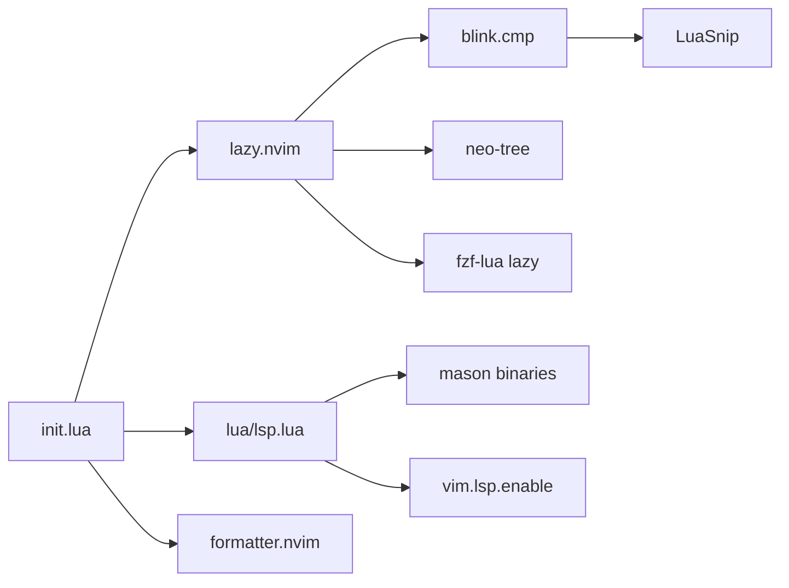

# Repository Guidelines

Personal Neovim config for Python / Lua / C++ (plus JSON, Bash, Swift/ObjC). Leader is `<space>`. Target Neovim ≥ 0.11 (`vim.lsp.config` / `vim.lsp.enable`). Docs are Simplified Chinese; this file is for agents.

## Project Overview

Dotfiles, not an application. `init.lua` loads Lua modules; `lua/plugins.lua` bootstraps [lazy.nvim](https://github.com/folke/lazy.nvim); LSP/formatters come from mason; UI is Monokai Pro + neo-tree + blink.cmp + fzf-lua.

There is no build system, no CI, no test suite, no `scripts/`. Success = `nvim` starts, plugins load, keymaps fire.

## Architecture & Data Flow

Strict eager load in `init.lua` (no `ftplugin/`, no `lazy.lua`):

```
basic_config → keymaps → snippets → plugins (lazy.setup)
  → monokai.setup{palette=pro} → lsp
  → config.neo-tree-cfg → config.nvim-formatter-cfg
  → print(">^.^< happy coding mio~")
```

**Plugin path.** `lua/plugins.lua` clones lazy.nvim to `stdpath('data')/lazy/lazy.nvim` if missing (`--branch=stable`). Specs are GitHub `owner/repo`. Almost everything is eager. Only **fzf-lua** is lazy (`cmd = "FzfLua"` + `keys`). neo-tree is `lazy = false`; its `config` fn requires `config.neo-tree-cfg` **before** `init.lua` requires the same module (second require is a cache no-op).

**LSP path.** `lua/lsp.lua` does `mason.setup` + `mason-lspconfig.ensure_installed` + `vim.lsp.config` / `vim.lsp.enable`. Do **not** call `lspconfig.*.setup()`. Capabilities come from `require('blink.cmp').get_lsp_capabilities()`. Buffer maps attach via `LspAttach` autocmd (`UserLspConfig`), not `on_attach`.

**Format path.** `BufWritePre` → `vim.cmd([[Format]])` (string form; `vim.cmd.Format()` is unreliable). formatter.nvim, not LSP format-on-save. jsonls has `provideFormatter = false` to avoid double-format. `<space>f` is LSP async format on attached buffers only.

**Search path.** neo-tree `/` filters the current tree node. Project search is fzf-lua (`fd` / `rg`). Keys are `<space>s*` so they do not prefix-stall `<space>f`.

**Snippet path.** blink.cmp `sources.default` includes `snippets` (LuaSnip). `lua/snippets.lua` is **not** LuaSnip — it is hand-written `inoremap` pairing / surround / ft abbreviations, loaded **before** plugins.



## Key Directories

| Path | Role |
|---|---|
| `init.lua` | Entry: require chain, `BufNewFile * :write`, statusline |
| `lua/basic_config.lua` | Options + `mapleader = <space>` |
| `lua/keymaps.lua` | Global maps (window, vimrc, mouse yank) |
| `lua/plugins.lua` | lazy bootstrap + all plugin specs |
| `lua/lsp.lua` | mason, servers, LspAttach, filetype overrides |
| `lua/snippets.lua` | Insert-mode pairing (not LuaSnip files) |
| `lua/config/` | Non-trivial plugin setup (`neo-tree-cfg.lua`, `nvim-formatter-cfg.lua`) |
| `README.md` | Overview + requirements |
| `KEYBINDINGS.md` | Full keymap/plugin tables (source of truth **except** mismatches below) |
| `lazy-lock.json` | Local pin only — **gitignored**, not a repo contract |

No `tests/`, `spec/`, `.github/`, Makefile, `package.json`, `.luarc.json`, or `stylua.toml`.

## Development Commands

```bash
nvim                          # first launch: lazy clone + mason install (network)
brew install fzf fd ripgrep   # fzf-lua runtime; already expected on PATH
```

Inside nvim: `:Lazy`, `:Mason`, `:Format` / `:FormatWrite`, `:FzfLua files`, `:Neotree filesystem toggle`.

Headless smoke (whole init chain must parse, no `E` / traceback):

```bash
nvim --headless "+lua print('ok')" +qa
nvim --headless "+Lazy! load fzf-lua" "+lua assert(type(require('fzf-lua').files)=='function')" +qa
nvim --headless "+lua print(vim.fn.maparg('<space>sf','n'))" +qa
```

Do not prove `:Format` headless — the formatter config comments that it is unreliable. Do not treat `lazy-lock.json` edits as reviewable repo changes (`.gitignore` is one line: `lazy-lock.json`).

## Code Conventions & Common Patterns

- **Lua, 4-space indent** in most files. `lua/config/nvim-formatter-cfg.lua` uses tabs — match the file you edit; do not restyle.
- **Comments in Chinese** with English identifiers (`<space>f`, server names). New comments should match.
- **New plugins:** add a spec in `lua/plugins.lua`. Non-trivial setup → `lua/config/<name>.lua` and `require` it (neo-tree pattern). Trivial setup → `opts = {}` / `keys` on the spec (fzf-lua pattern).
- **New keymaps:** leader is literal `<space>`, not `vim.g.mapleader` in `keymap.set`. Never bind `<space>f*` (stalls LSP format). Prefer `<space>s*` for search. Check collisions: `<space>e` vs `<space>ec`; `<space>sc` vs `<space>s*`.
- **LSP:** `vim.lsp.config(name, { capabilities, cmd?, filetypes?, ... })` then `vim.lsp.enable({...})`. mason-lspconfig `ensure_installed` is **only** LSP servers (`pylsp`, `lua_ls`, `clangd`). Extra mason packages use `ensure_mason_packages()` in `lua/lsp.lua` (`stylua`, `prettier`, `shfmt`, `clang-format`, `ruff`). `sourcekit` is `xcrun sourcekit-lsp` — not mason.
- **Filetypes:** `.m` / `.mm` → `objc` / `objcpp` via `vim.filetype.add` (Neovim 0.12 defaults `.m` to `matlab`). Never map to `objective-c` — no `syntax/objective-c.vim`. sourcekit language id is remapped by lspconfig `get_language_id`.
- **jsonls** must keep formatter disabled. Lua stylua skips filename `special.lua`.
- **neo-tree / fzf-lua:** `<CR>` opens a **new tab** (`open_tabnew` / `actions.file_tabedit`), never replaces the current window — **except** `blines` (`<space>sl`): `enter` is `file_edit` so it stays in the current window. Override lives in `lua/plugins.lua` `opts`.
- **flash.nvim:** `s`/`S` jump (no treesitter). Do not map `S` to `flash.treesitter()`. `f`/`t` enhanced after VeryLazy. Substitute → `cl`.
- **Invariants:** `autocmd BufNewFile * :write` writes every new buffer immediately. Statusline is hardcoded in `init.lua`. `clipboard=unnamedplus` + visual `<LeftRelease>` → `ygv`.
- **Do not** introduce `lspconfig.setup`, nvim-cmp, nvim-tree, or `<space>ff`. Do not add LuaSnip snippet files unless asked — current LuaSnip usage is blink's `snippets` source only.
- `vim.api.nvim_exec` in `snippets.lua` is deprecated on 0.11; leave it unless touching that file.

## Important Files

| File | Why it matters |
|---|---|
| `init.lua` | Load order, auto-write, statusline, greeting |
| `lua/plugins.lua` | Plugin graph; fzf-lua keys live here |
| `lua/lsp.lua` | Servers, mason packages, LspAttach, filetype map |
| `lua/config/nvim-formatter-cfg.lua` | Per-ft formatters + BufWritePre |
| `lua/config/neo-tree-cfg.lua` | Tree options + `<space>o` |
| `lua/keymaps.lua` | Window / vimrc / mouse maps |
| `lua/snippets.lua` | Pairing maps; not snippet snippets |
| `KEYBINDINGS.md` | Human keymap dump — verify against source before trusting |

**Doc drift (trust source):** KEYBINDINGS resize rows (`<space><C-hjkl>` ±2) are wrong — code is `<C-Arrow>` ±5. KEYBINDINGS header still says `config.nvim-tree-cfg`. Python `ruff` formatter exists in code, missing from README/KEYBINDINGS tables. neo-tree `<CR>` docs say “open file”; code is `open_tabnew`. sourcekit `filetypes` also include `c`/`cpp`. vim abbrev `<b` has no RHS in source.

## Runtime/Tooling Preferences

- **Editor:** Neovim ≥ 0.11 (required API).
- **Plugin manager:** lazy.nvim (git clone, not luarocks/npm). Pin in spec with `version` / `branch` (`blink.cmp` `1.*`, LuaSnip `v2.*`, neo-tree `v3.x`).
- **LSP/tools:** mason.nvim. Host binaries: `fzf`, `fd`, `rg`; Nerd Font; Xcode for sourcekit.
- **No Node/Bun/Python project toolchain.** Python LSP is `pylsp`; format is `ruff format` via formatter.nvim.
- **Lockfile is local-only.** Fresh clones resolve latest on each spec's branch.

## Testing & QA

None. No busted, plenary test harness, mini.test, or coverage.

Validate by:

1. Headless load (commands above) after Lua edits.
2. `vim.fn.maparg(...)` for keymap changes (lazy `keys` register even before plugin load).
3. Interactive: `:checkhealth lsp`, open a `.m` and `:set ft?` → `objective-c`.
4. After plugin spec changes, one GUI/TUI `nvim` launch so lazy can clone.

Do not add a test suite unless the user asks.
